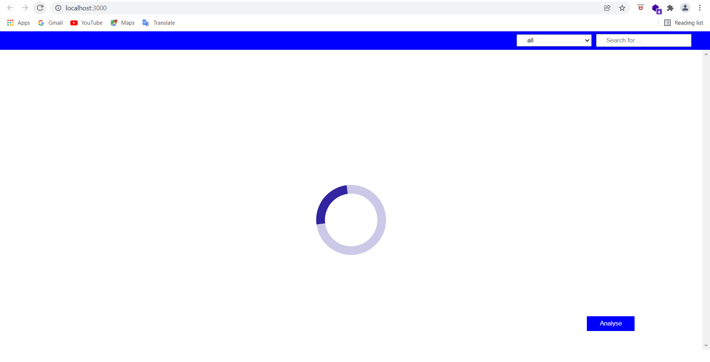
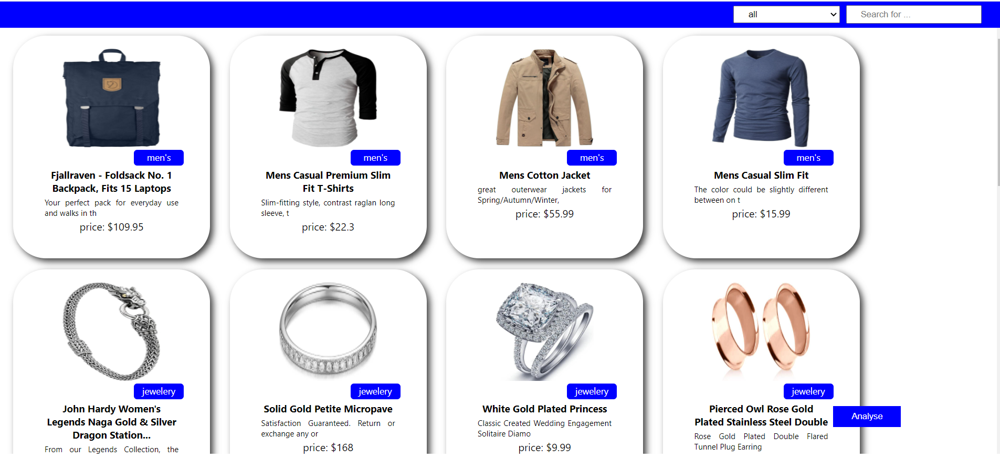
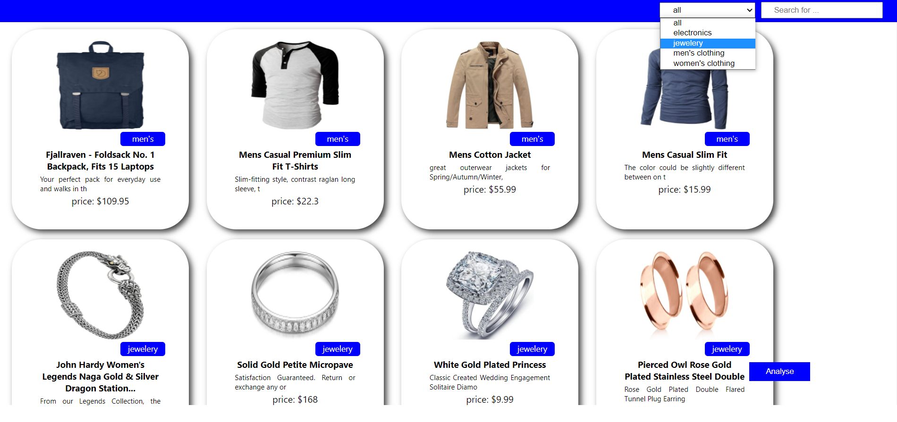
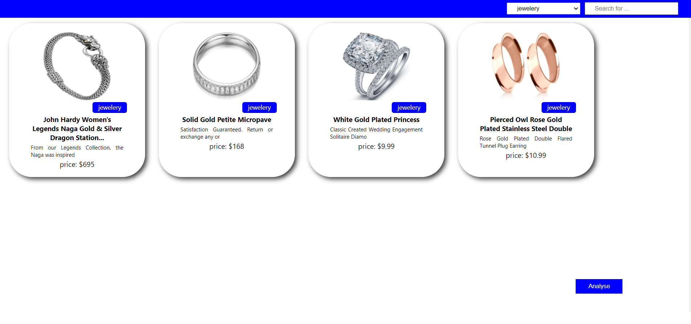
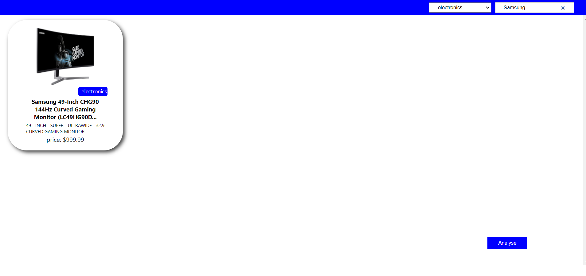
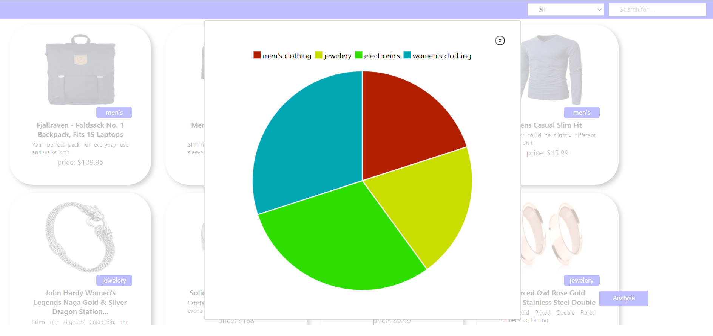
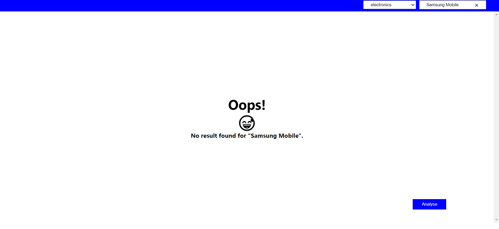

# Catalogue Management Application
It is an application to manage products by search query and filter categories. 
It also provides you with category visualization through a pie chart.

# 🚛 Features
- 🔍 Search products
- 🗃 Filter products
- 📈 Categories Visualization
- 🖼 Responsive UI

# 🏗 Built with
- React.js

### 🍔 Things Used
- ♟ useState 
- ♟ useEffect
- ♟ react-modal
- ♟ react-chartjs-2

### API Used
- fakestoreapi API

## 🏗 Setup 
1. Fork the repo by clicking the fork button
2. Clone the repo
```
    $ git clone https://github.com/your_github_username/catalogue_management.git
```
3. change to project directory
```
    $ cd catalogue_management
```
4. you need to install node_modules
```
    $ npm install
```
It's time to run the project
```
    $ npm start
```

# 📷 Screenshots
<br/>
<br/>
<br/>
<br/>
<br/>
<br/>
<br/>

